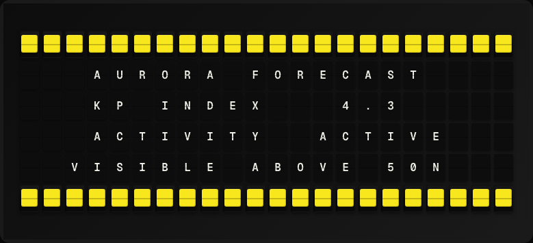

# Aurora Forecast Plugin

Display the current geomagnetic storm (Kp) index and aurora activity forecast.



**→ [Setup Guide](./docs/SETUP.md)**

## Overview

The Aurora Forecast plugin queries NOAA's Space Weather Prediction Center (SWPC) for the current planetary Kp index, which indicates geomagnetic activity. A Kp of 5+ means aurora may be visible at mid-latitudes. No API key required.

## Template Variables

| Variable | Description | Example |
|---|---|---|
| `aurora_forecast.kp_index` | Current Kp index (0-9) | `3.67` |
| `aurora_forecast.activity` | Activity level description | `Quiet` |
| `aurora_forecast.aurora_visible` | Yes if aurora likely visible at mid-latitudes | `No` |

## Example Templates

```
AURORA FORECAST
Kp Index: {{aurora_forecast.kp_index}}
Activity: {{aurora_forecast.activity}}
Aurora Visible:
{{aurora_forecast.aurora_visible}}

```

## Configuration

| Setting | Name | Description | Required |
|---|---|---|---|
| `refresh_seconds` | Refresh Interval | How often to fetch data (seconds) | No |

## Features

- Real-time NOAA Kp geomagnetic index
- Human-readable activity description
- Aurora visibility indicator
- No API key required

## Author

FiestaBoard Team
